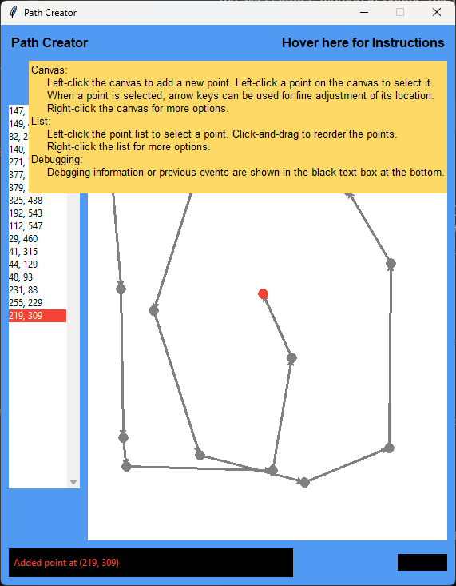

# Mobile Robotics Fall 2024

## Final Project: Word Writing Challenge

The overall mission objective is to allow a mobile robot to autonomously write English words on
the floor. The word writing activity can be supported with robot dead-reckoning or through
recognition of features in its surrounding environment using Lidar or camera sensors.

In each trial, each team will be provided with a 3-6 letter word. The robot would
then be required to use driving to display this word (any font type is allowed).

The first competition trial will be performed offline. The day before the actual competition day,
each team will be uploading to a Google drive a pre-recorded video of the SMART robot driving
a word in an environment chosen by the team. For this run, the word is “ROBOT”.

The in-person competition will include two trials with a word provided right before each trial.
After the robot displayed a word, visitors and other students not on the same team will be asked
to guess the word. If more than 50% of the guesses are correct, the run would be declared as
successful.

## Path Creator

### To Do
- [x] Save and load csv files
- [x] Adjust coordinate system so bottom left is origin (match english letter writing)
- [x] Display x and y position of cursor on canvas in bottom right
- [x] Error and event messages
- [x] Lock x and y axis values to currently selected point for placing points
- [x] 4:3 aspect ratio for canvas (match most fonts)
- [x] Autoscroll the list when it overflows
- [ ] Click and drag canvas points to reorder

## Plan:
- load points in path as string
  - need to handle making paths between letters

- now have a total list of point

- load in a new current goal point from total list
  - while not reached the current goal point 
    - take in sensor data, create state estimate
    - run control loop, apply controls
    - check if reached goal (threshold)

x and y swap fixed
but the scaling needs fixed
handle between letters
tune pid parameters 

nice to have 
different param values for each letter 
different values for types of letters
